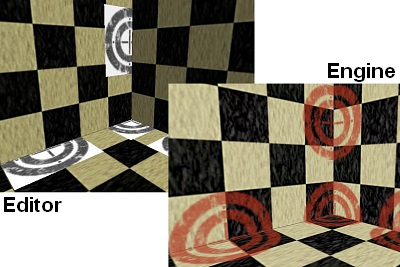
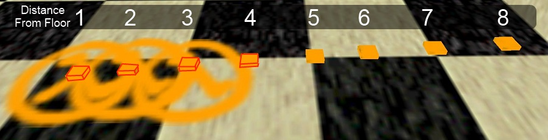
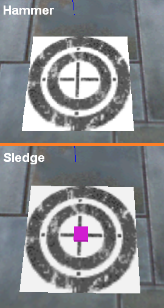
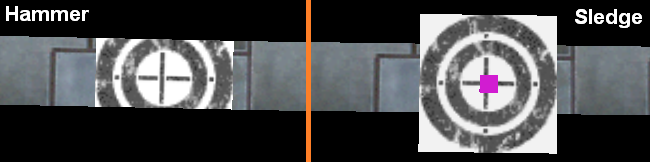
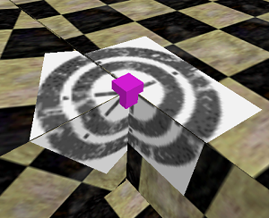
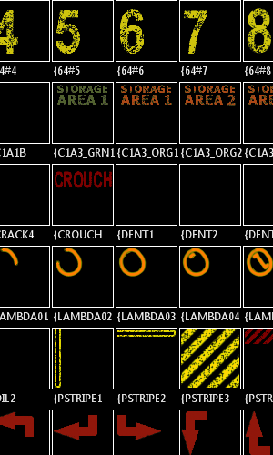
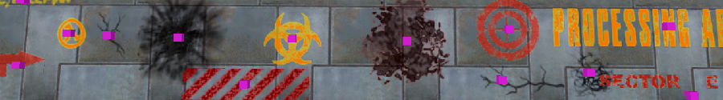

This is an example of something that's much more difficult than it should be: Decal rendering. In Goldsource, decals are "stamps" that are applied to a brush face. They're commonly used for blood stains, graffiti, bullet holes, and signs. These sound like pretty simple things to work with, but in reality they're much trickier than they first appear when you have to render them in an editor.

This post is sort of an in-depth look at some of the technical aspects of Sledge development, though hopefully it wont be so complex as to alienate people who aren't programmers or mappers. As of writing this paragraph, I haven't actually implemented this feature, I will be writing the code for decals and writing the content of this post at the same time.

## What Are Decals?

Before I implement a feature, I need to ensure that all the functionality of said feature has been scoped out in my mind. The first step for me when planning a feature in Sledge is to play with it in Hammer (the official Goldsource editor) until I am confident of its functionality. Below are my notes while using the decal tool in Hammer 3.5:

    
    Decals behave differently in the editor when compared to the engine.

- A typical decal will be applied in such a manner that it will only render onto one face
- However: A single decal can be applied to multiple faces if the decal is placed correctly
- The position of the decal can be changed by changing the origin of its "infodecal" entity
- The texture properties of the decal are inherited from the face it is being rendered on
- A decal placed near the edge of a face is clipped to the face and does not spill over the edge
- Decals can only be applied when both the select tool and the decal tool are selected (bad UI)
- Decals are often very difficult to select, delete, and reposition after they have been applied (bad UI)
- Hammer does not render decals as they appear in the engine, rather as they appear in the texture file (bad UI)
- Decals do not update if their properties change (bug)
- Decals do not update if their faces' properties change (bug)
- Decals in Hammer and in Goldsource behave differently when multiple faces are involved (inconsistency)
- Multiple-face behaviour seems unpredictable in both the editor and engine (inconsistency)

After reviewing this list, I have a general idea of what decals are, how they are used, and how to render them. However, I have a reasonably major problem that I need to resolve before implementation can begin, and that's the last two points: the inconsistencies. These are one of the reasons why decals are one of the more difficult things to implement in Sledge - there are two different ways they can behave, and I don't know the specifics of either of them. For me, the behaviour of the engine is the one that I want to replicate, so I need to figure out what it's doing.

To figure out the next step, I asked for advice from the Goldsource veterans over on [TWHL](https://twhl.info/thread/view/18288), and got a hit pretty quickly. So you don't have to read through it yourself, here's the low down from the all-knowing Daubster:

> In the game code it determines the world geometry affected by tracing along the min/max of a 10x10x10 bounding box centered around the origin of the infodecal.

This is exactly the information that I needed to continue work on this. First, I need to run a simple test to confirm this behaviour. I place a bunch of tiny brushes varying distances from the floor, and apply a decal to the underside of each one. If the theory is correct, the brushes less than 5 units from the floor will have a decal on the floor underneath them, and the brushes more than 5 units from the floor will not. The results of the test can be seen below.

The results of the test suggest that the bounding box is 8 units in size, rather than 10.

Looking at these results, the decals that are 3 or less units away from the floor are appearing on the floor, and decals that are 4 or more units away from the floor are not appearing at all. This is different to our expected result of 5 units, however it does confirm the engine behaviour - that is, the engine code applies the decal to all faces that are within a certain bounding box centered around the origin of the decal. Going by these results, I've decided to use a 8x8x8 bounding box to perform the same calculation in Sledge, as this value appears to conform to the engine behaviour.

## Implementing Decals

A comparison between the two editors after the first step of decal rendering.

Next comes the task of doing the actual implementation of the decal functionality. First of all, the geometry for the decal must be calculated. Decals might render as stamps in the engine, however it isn't quite that simple when you need to perform the rendering yourself. An extra face needs to be created, using the decal as the texture. The new face is then positioned on top of the existing face - the new face is the one that will be drawn when the decal is rendered.

Generating the basic geometry isn't exactly simple, but it's not extremely complex either. The general procedure goes something like this:

1. Find all the faces that the decal will be applied to
2. Calculate the center of the decal texture on each face
3. Project the decal texture onto the face
4. Create the geometry based on the texture projection

The code for performing these steps can be seen in the [commit details over on Github](https://github.com/LogicAndTrick/sledge/commit/beb031563aac796d52727a36aa13358be4979895#L4R127). The part that actually does the job is bookmarked in the URL so you should jump straight to it, the other changes are glue to make the decals render properly. The results are visible in the image to the right.

Looks good, right? But we're not there yet! There's plenty of other things that need to be done before the decals match the features in my original notes. We've only satisfied these conditions so far:

- A typical decal will be applied in such a manner that it will only render onto one face
- However: A single decal can be applied to multiple faces if the decal is placed correctly
- The texture properties of the decal are inherited from the face it is being rendered on

...which means there's 9 more requirements that need to be met. Let's move on to the next step: geometry clipping. So far, the geometry generated will always be a rectangle, and the size will always be the same as the decal texture. This is fine for when the decal has plenty of space around it, but take a look at what happens when we make it a bit smaller:

Comparison of the decal geometry clipping in Hammer and Sledge (without clipping)

Well, that's no good. The geometry is spilling over the edge. This is because one of the rules has not been implemented yet: *A decal placed near the edge of a face is clipped to the face and does not spill over the edge*. So let's implement that next - if you're interested in the code, you can [take a look at the new commit log](https://github.com/LogicAndTrick/sledge/commit/1041ba5c192fbcaf04e51c3f20f43b232b2dc31f#L0R174). There are a few other minor changes, but nothing significant. The screenshot to the right shows the fixed code clipping the decals properly across face edges.

The decal geometry in Sledge after clipping has been implemented

The next step is updating the decal whenever a change is made. The decal geometry needs to be recalculated every time one of these events occur:

- The decal's origin is moved
- One of the decal's faces is moved
- A new face is moved within the decal's bounding box
- The texture properties of one of the decal's faces are changed

This creates some unfortunate dependencies: due to the third point above, the bounding box of every decal must be checked every time any geometry is moved, just in case that geometry has been moved inside the effect radius of the decal. This is a potential performance issue, and will need to be treated with care in order to reduce the amount of work that need to be done every time this happens. The other three points above are, comparatively, easy to implement in a performance-friendly way.

However, I follow the principle of [premature optimisation usually not being a good idea](http://c2.com/cgi/wiki?PrematureOptimization), because most of the time the code you optimise ends up being more difficult to read, and the bottleneck ends up being somewhere else. So for now, I think the naive approach is the best way to go. If you [take a look at the commit log](https://github.com/LogicAndTrick/sledge/commit/35c3b0d513d975d2507fac6144d94523964b79d6#L2L79), you can see that this potentially difficult task has been implemented in a change to just one line that updates the map objects after every change (the bookmarked one). Again, there are some other changes, but those are just some small bug fixes that I picked up during testing.

Finally, there's one more thing that needs to be added before we can call this 'feature-complete', and that's the tool that lets you create them in the first place. Fortunately, this is a reasonably simple tool to create: the user clicks in the 3D view, and a decal is created on the face that was clicked. There are a few other tools that do something similar (the select and texture tools select faces that are clicked in the 3D view, the entity tool creates entities in a similar manner, etc), so this should be fairly straight forward. [Here's the commit log for the decal application tool](https://github.com/LogicAndTrick/sledge/commit/08a0ba346da5708d4c972ccf1688e1b494efc00f#L4R38) - the real stuff happens in the bookmarked function, the other changes are adding the icon for the tool and putting it into the list of available tools.

## New Features and Improvements

Okay! We have a nice implementation of decals now - if you compare it to Hammer, it is reasonably similar in functionality. But that's not good enough! Let's take another look at the bugs and UI issues that I found in my original notes. I've italicised bugs that I already fixed during implementation, and bolded ones that still exist:

- *Decals can only be applied when both the select tool and the decal tool are selected (bad UI)*
- *Decals are often very difficult to select, delete, and reposition after they have been applied (bad UI)*
- **Hammer does not render decals as they appear in the engine, rather as they appear in the texture file (bad UI)**
- *Decals do not update if their properties change (bug)*
- *Decals do not update if their faces' properties change (bug)*
- *Decals in Hammer and in Goldsource behave differently when multiple faces are involved (inconsistency)*
- *Multiple-face behaviour seems unpredictable in both the editor and engine (inconsistency)*

Altering the textures during load means that the texture browser shows the correct decal colours

...Oh. Well, it turns out I accidentally went and made almost all the improvements without realising it. Since I've just created the decal tool, I know that you can't have two tools selected at once. That solves the first issue. I've also decided to render the decal's bounding box in Sledge, which conveniently solves the inconsistencies (all faces that touch the box will get the decal), as well as the issues with selection (the box can be clicked to reliably select the decal). Hammer also didn't update the decal geometry very well, it usually required the map to be closed and re-opened before it updated - however, this is something that was already fixed when the updating feature was implemented.

This leaves only one small issue left, and that's the rendering. If you go back to the first screenshot in this post, you can see that the engine renders the decal with transparency and colour, but the editor renders it in greyscale with a solid white background. This is because Goldsource doesn't support transparency in textures - so the decal textures are created in a special way for the engine to give them a colour and a transparent background. I want to be able to see how the engine will render the decal in Sledge, so I will need to implement this functionality in the renderer.

There are two ways that this can be done. The easy way is to use a shader over the decal geometry to convert the greyscale values into the proper transparency and colour values on-the-fly. This is fairly cheap to implement using an OpenGL fragment shader, and will do the job reasonably well. However, I also want the "real" decal colours to appear in the texture browser, and this isn't rendered using OpenGL. The second way to do this is to change the decal texture itself when it is loaded from the disk. This is the approach I will take.

Altering the textures on load can be quite expensive, but fortunately there are some easy work-arounds that make it much faster. Because textures from Goldsource WAD texture packages load as indexed bitmaps, it means that I have access to the bitmap palette. Changing the palette allows me to quickly alter all the pixels in the bitmap without needing to inspect them individually (which is very slow). Fortunately, the special properties of transparency in the WAD format also uses the palette, so I have access to the data I need to make this change. If you're interested in the source code, [here is the commit log for the texture loading change](https://github.com/LogicAndTrick/sledge/commit/c6fa811b46f7bd3741f143e0115384a29054683c#L3R15).

The final result: Decals rendering in Sledge after all the required functionality has been implemented

## Wrapping Up

Now that the major features of decals have been implemented, I can tick that box on my to-do list. However, like most things, it's still not done yet. Some minor things are relying on features that haven't been implemented yet, there are some to-do's and small bugs that still need to be fixed. It's implemented, but not polished. Most of the polishing work will happen over time as other features are implemented, but that kind of stuff isn't ever as fun as creating a big new feature from scratch.

I enjoyed blogging about something I'm implementing, it certainly helped me think about how to do things in the code when I was typing out the post. If you've gotten this far, thanks for reading! I'm going to try and do more of these in the future - if I'm going to write a blog that nobody reads, I might as well have some fun while doing it!